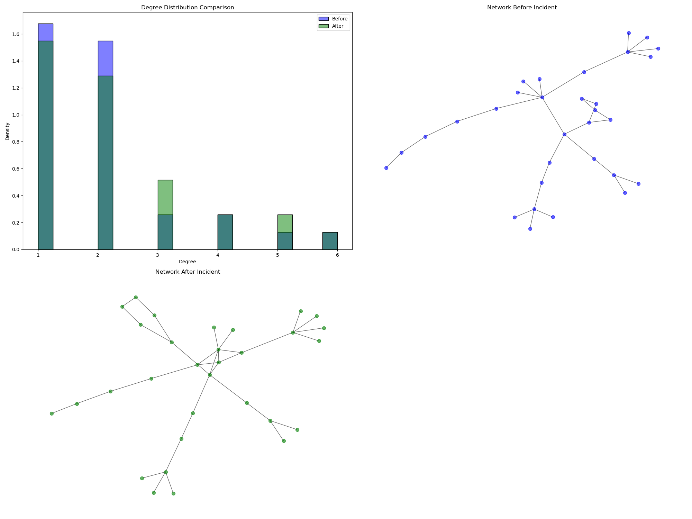
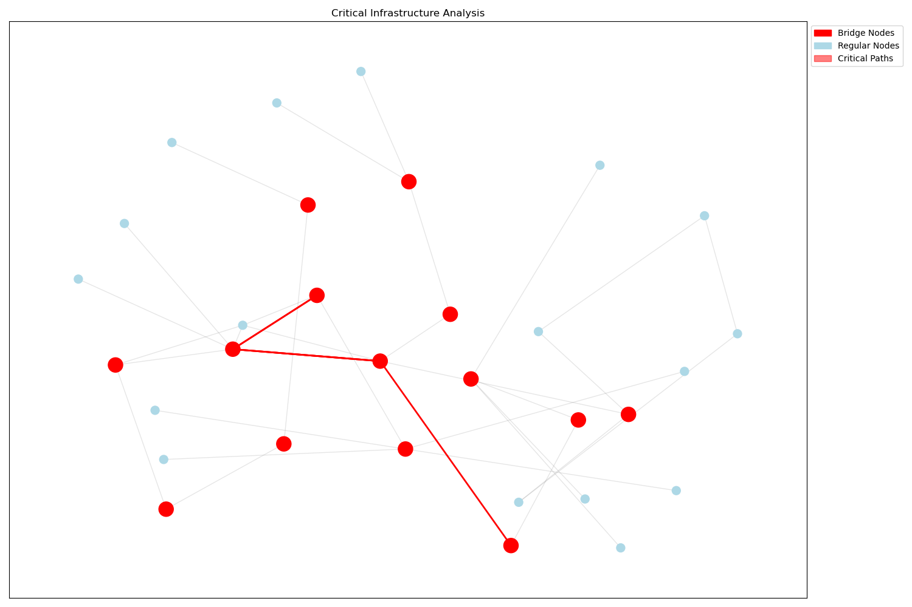
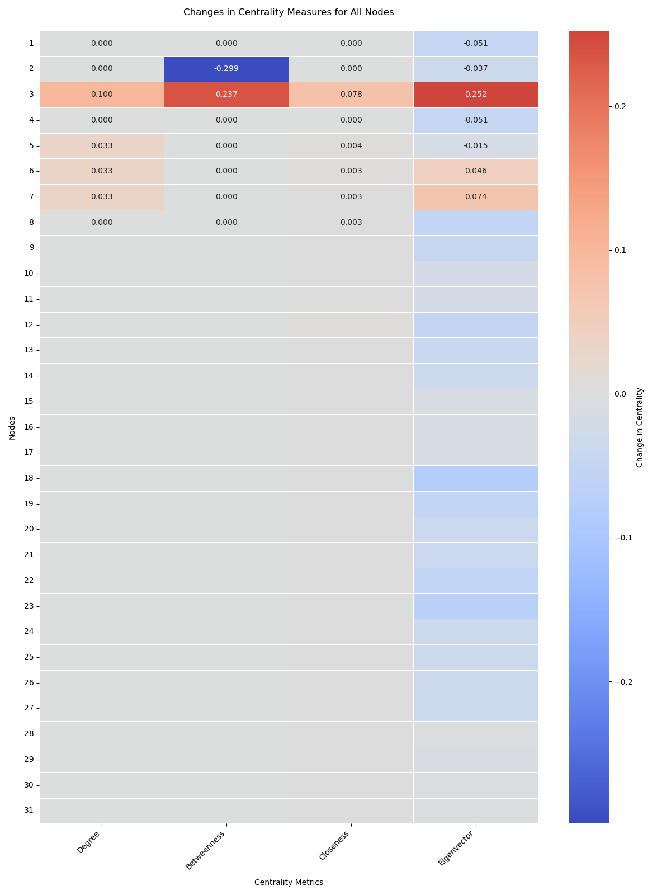

# Post-Incident Network Analysis Report

## Network Overview



## Critical Infrastructure Analysis



## Spectral Metrics

| Metric             |    Before |     After |    Change |
|:-------------------|----------:|----------:|----------:|
| Spectral Radius    | 2.95488   | 9.17427   | 6.21939   |
| Fiedler Eigenvalue | 0.0571823 | 0.0873856 | 0.0302033 |

## Other Network-Level Changes

| Metric                |      Change |
|:----------------------|------------:|
| Average Clustering    |  0.0473118  |
| Network Density       |  0.00645161 |
| Average Degree        |  0.193548   |
| Components            |  0          |
| Average Path Length   | -0.0580645  |
| Network Diameter      |  0          |
| Number of Communities | -1          |

## Structural Changes

| Structural Change          |   Value |
|:---------------------------|--------:|
| New Nodes                  |       0 |
| Removed Nodes              |       0 |
| New Edges                  |       3 |
| Removed Edges              |       0 |
| Degree Distribution Change |       3 |

## Node Metrics Changes Heatmap



### Detected Anomalies

|    Degree |   Betweenness |   Closeness |   Eigenvector |   anomaly |
|----------:|--------------:|------------:|--------------:|----------:|
| 0         |     -0.298851 |  0          |    -0.0367362 |        -1 |
| 0.1       |      0.236782 |  0.078458   |     0.252463  |        -1 |
| 0.0333333 |      0        |  0.00410397 |    -0.0151893 |        -1 |

## Additional Metrics

```plaintext
=== K-Core Numbers (After) ===
2: 2
1: 1
3: 2
4: 1
5: 2
6: 2
7: 2
8: 1
9: 1
10: 1
11: 1
12: 1
13: 1
14: 1
15: 1
16: 1
17: 1
18: 2
19: 2
20: 2
21: 2
22: 2
23: 1
24: 1
25: 1
26: 1
27: 1
28: 1
29: 1
30: 1
31: 1

=== Degree Assortativity Coefficient ===
Before: -0.524167, After: -0.235722

=== Local Efficiency ===
Before: 0.000000, After: 0.058602

=== Network Robustness ===
Before Removal:
  Largest_Connected_Component_After_Node_Removal: 6
  Connected_Component_Size_Change_After_Node_Removal: -25
  Largest_Connected_Component_After_Edge_Removal: 10
  Connected_Component_Size_Change_After_Edge_Removal: -21
  Percentage_Of_Network_Intact_After_Node_Removal: 19.35483870967742
  Percentage_Of_Network_Intact_After_Edge_Removal: 32.25806451612903
After Removal:
  Largest_Connected_Component_After_Node_Removal: 7
  Connected_Component_Size_Change_After_Node_Removal: -24
  Largest_Connected_Component_After_Edge_Removal: 20
  Connected_Component_Size_Change_After_Edge_Removal: -11
  Percentage_Of_Network_Intact_After_Node_Removal: 22.58064516129032
  Percentage_Of_Network_Intact_After_Edge_Removal: 64.51612903225806

```
