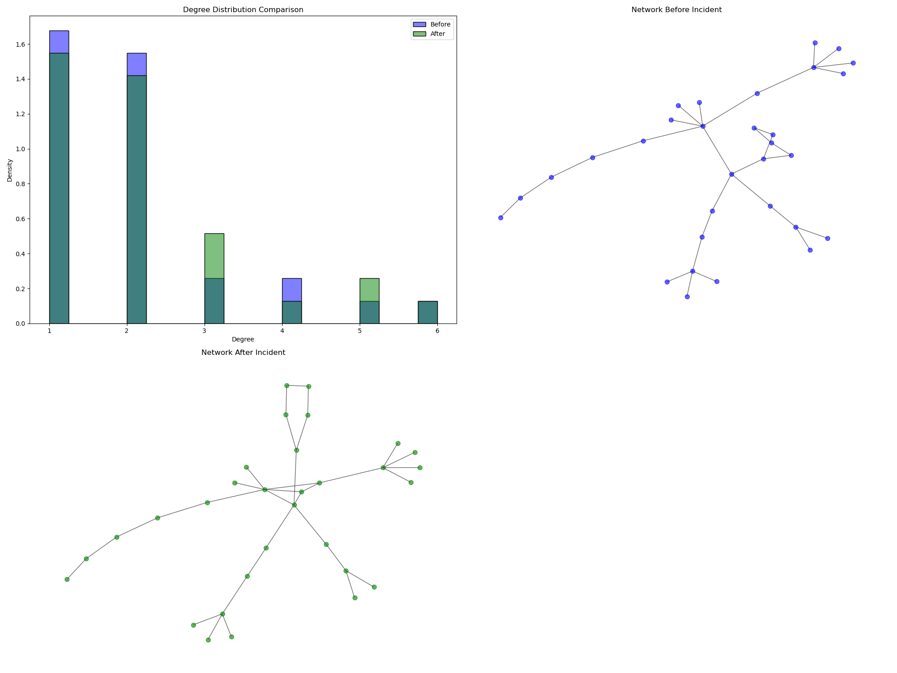
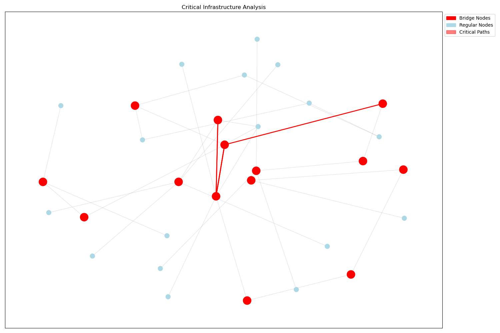
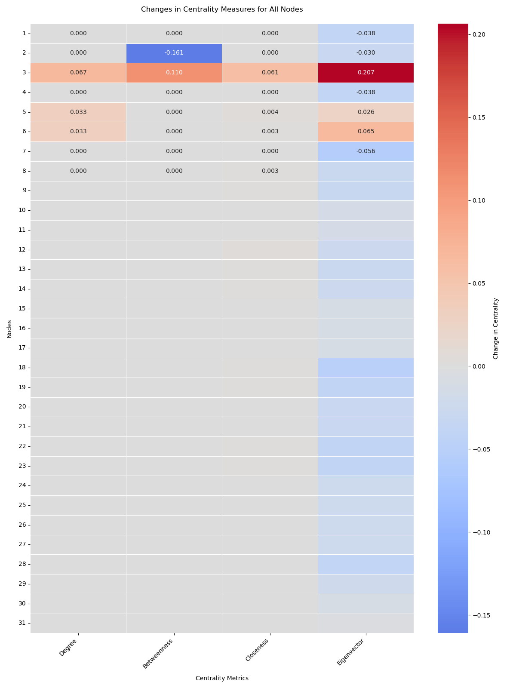

# Post-Incident Network Analysis Report

## Network Overview



## Critical Infrastructure Analysis



## Spectral Metrics

| Metric             |    Before |     After |    Change |
|:-------------------|----------:|----------:|----------:|
| Spectral Radius    | 2.95488   | 7.61878   | 4.6639    |
| Fiedler Eigenvalue | 0.0571823 | 0.0741527 | 0.0169704 |

## Other Network-Level Changes

| Metric                |      Change |
|:----------------------|------------:|
| Average Clustering    |  0.0397849  |
| Network Density       |  0.00430108 |
| Average Degree        |  0.129032   |
| Components            |  0          |
| Average Path Length   | -0.0473118  |
| Network Diameter      |  0          |
| Number of Communities | -1          |

## Structural Changes

| Structural Change          |   Value |
|:---------------------------|--------:|
| New Nodes                  |       0 |
| Removed Nodes              |       0 |
| New Edges                  |       2 |
| Removed Edges              |       0 |
| Degree Distribution Change |       3 |

## Node Metrics Changes Heatmap



### Detected Anomalies

|    Degree |   Betweenness |   Closeness |   Eigenvector |   anomaly |
|----------:|--------------:|------------:|--------------:|----------:|
| 0.0666667 |      0.110345 |  0.0605282  |     0.206507  |        -1 |
| 0.0333333 |      0        |  0.00410397 |     0.025703  |        -1 |
| 0.0333333 |      0        |  0.00269542 |     0.0652758 |        -1 |

## Additional Metrics

```plaintext
=== K-Core Numbers (After) ===
2: 2
1: 1
3: 2
4: 1
5: 2
6: 2
7: 1
8: 1
9: 1
10: 1
11: 1
12: 1
13: 1
14: 1
15: 1
16: 1
17: 1
18: 2
19: 2
20: 2
21: 2
22: 2
23: 1
24: 1
25: 1
26: 1
27: 1
28: 1
29: 1
30: 1
31: 1

=== Degree Assortativity Coefficient ===
Before: -0.524167, After: -0.323338

=== Local Efficiency ===
Before: 0.000000, After: 0.046237

=== Network Robustness ===
Before Removal:
  Largest_CC_After_Node_Removal: 6
  Largest_CC_After_Edge_Removal: 10
After Removal:
  Largest_CC_After_Node_Removal: 6
  Largest_CC_After_Edge_Removal: 20

```
